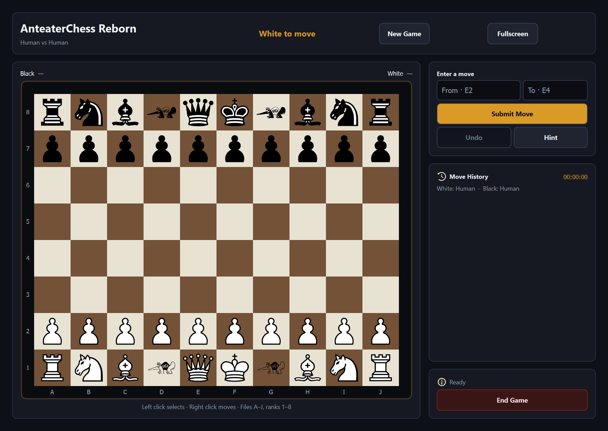
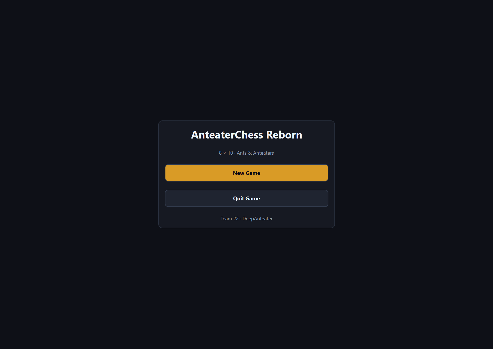
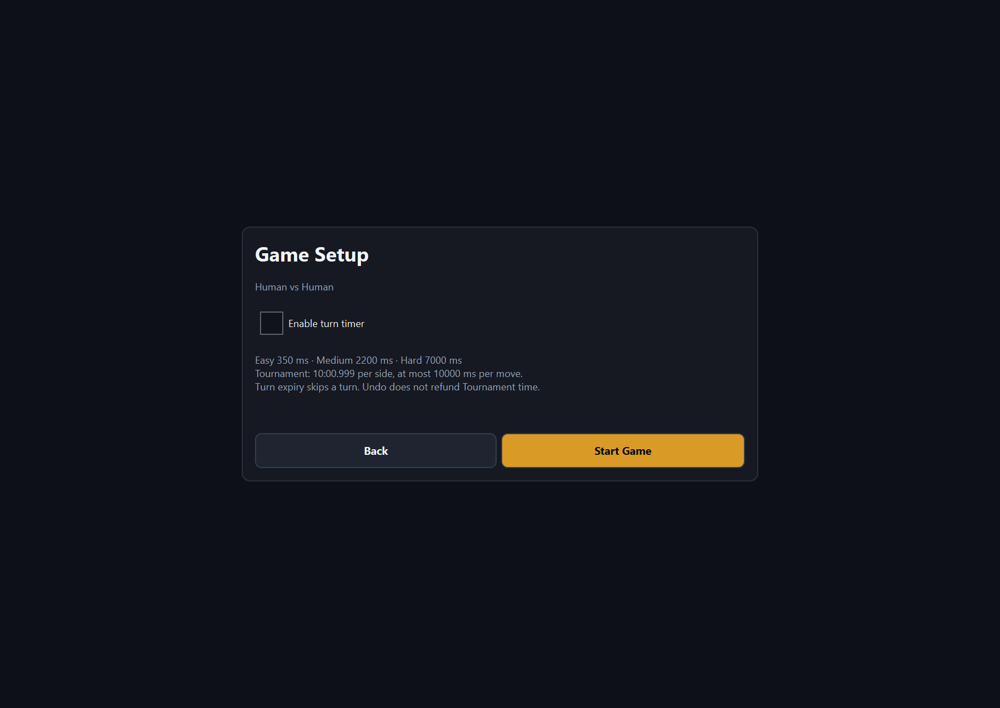
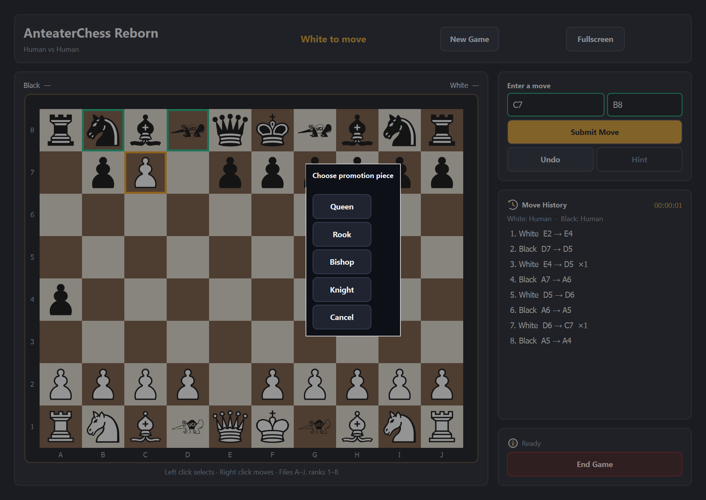

<div align="center">

# AnteaterChess Reborn

### A bigger board. A new kind of chess.

**Ants, chain-capturing Anteaters, and 80 squares to explore.**

[](https://github.com/Yide-Milo-Li/AnteaterChess-Reborn/releases/latest)
[](https://github.com/Yide-Milo-Li/AnteaterChess-Reborn/actions/workflows/ci.yml)


[**Download v2.1.0**](https://github.com/Yide-Milo-Li/AnteaterChess-Reborn/releases/tag/v2.1.0) · [How to play](docs/user/manual.md) · [Build from source](docs/development/guide.md) · [Release notes](docs/development/release-notes.md)

</div>



AnteaterChess Reborn is a local desktop chess variant created at **UC Irvine**.
Play a friend, challenge the AI, or watch two engines compete. An **8 × 10 board**
adds room for Ants and Anteaters while keeping familiar pieces, castling, en
passant and promotion.

Version **2.1.0** brings the native **C++20 / Qt 6 + QML** implementation to the
release line, with a Qt-independent core and reproducible CMake/CTest/CPack builds.
The earlier [v2.0.1](https://github.com/Yide-Milo-Li/AnteaterChess-Reborn/releases/tag/v2.0.1)
contains the historical C11/GTK implementation.

## Get the game

| Platform | Download | Start playing |
| --- | --- | --- |
| **Windows x64** | [Portable ZIP](https://github.com/Yide-Milo-Li/AnteaterChess-Reborn/releases/download/v2.1.0/AnteaterChess-Reborn-2.1.0-windows-x64.zip) | Extract everything to a writable folder; launch `anteater-chess.exe`. |
| **Ubuntu 24.04 x64** | [Linux TGZ](https://github.com/Yide-Milo-Li/AnteaterChess-Reborn/releases/download/v2.1.0/AnteaterChess-Reborn-2.1.0-linux-x64.tar.gz) | Install the Qt packages in `INSTALL.md`; launch `./anteater-chess`. |
| **Source** | [Source archive](https://github.com/Yide-Milo-Li/AnteaterChess-Reborn/releases/download/v2.1.0/AnteaterChess-Reborn-2.1.0-source.tar.gz) | Follow the [development guide](docs/development/guide.md). |

Windows includes its required runtime libraries. Keep the DLLs, `plugins/`,
`qml/` and `qt.conf` beside the executable. Ubuntu uses system Qt libraries and
requires a graphical session. macOS packages are not available.

Every archive includes `SOURCE_REVISION` and `FILES.sha256`; runtime packages
also include `INSTALL.md`, dependency inventories and license notices. SHA-256
sidecars are available with the downloads. See [package verification](docs/development/guide.md#install-and-cpack).

## Meet the variant

| Piece | What changes |
| --- | --- |
| **Ant** | Advances like a pawn, captures diagonally, and promotes to Queen, Rook, Bishop or Knight. |
| **Anteater** | Moves to an adjacent empty square, or captures an adjacent enemy Ant and continues through an orthogonally connected capture chain. |
| **The board** | Ten files, A–J, and eight ranks. Each side starts with two Anteaters and ten Ants. |

An Anteater captures **Ants only**. Its first capture may be diagonal; later
captures in the same chain must be orthogonal. A chain can stop after any capture,
up to ten. Coordinate input rejects ambiguous paths. The [manual](docs/user/manual.md#pieces-and-special-moves)
explains the full rules, including the variant's castling positions and draw policies.

## Choose your game

- **Human vs Human** — share the board for a local match.
- **Human vs AI** — choose your color and Easy, Medium, Hard or Tournament difficulty.
- **AI vs AI** — set both opponents and watch the game unfold.

Click a friendly piece, then right-click a highlighted destination, or enter
coordinates. Ask for a hint, review move history, undo according to the game mode,
and switch fullscreen with **F11** / **Escape**. Optional turn timers skip an
expired turn; Tournament uses a separate per-player time budget.

<table>
<tr>
<td width="50%"><br /><b>A focused start</b><br />Start a new game from the native desktop menu.</td>
<td width="50%"><br /><b>Your match, your pace</b><br />Choose the mode and configure player and timer settings.</td>
</tr>
</table>

<details>
<summary><b>See promotion in the native interface</b></summary>



</details>

Screenshots are captured from the maintained Windows Qt interface at an actual
1.5 device pixel ratio using deterministic desktop test positions.

## Under the hood

The desktop routes game commands through one owning **Session**. Rules, policy
and AI compile independently of Qt. Background search owns its input snapshots,
supports cooperative cancellation, and checks result identities before applying
moves or hints. SVG pieces follow board size and display pixel ratio. Per-game
logs live in `logs/` beside the executable.

| Layer | Source | Responsibility |
| --- | --- | --- |
| Desktop | `apps/qt/` | QML pages, typed models, controller, background jobs and runtime |
| Session | `src/session/` | Live game, transactions, history, revisions and clocks |
| Rules | `src/rules/` | Position, legal moves, reversible execution and endgame rules |
| Policy | `src/policy/` | Configuration, depth selection and Tournament budgets |
| AI | `src/ai/` | Owning search contexts, evaluation and search |

The [interactive architecture](docs/architecture/architecture.html) and
[software specification](docs/architecture/software-specification.md) describe
the current contracts. The game supports local play; networking and saved-game
import/export are outside its feature set.

## Build and verification

**Windows:** native MSVC v143 **14.44 x64**, CMake ≥ 3.25, Ninja, Python 3 and
**Qt 6.11.2 MSVC 2022 x64** with Shader Tools.

```powershell
. ./tools/native/Enter-NativeEnvironment.ps1 -RequireQt -RequirePython
cmake --preset windows-release
cmake --build --preset windows-release
ctest --preset windows-release
./build/windows-release/bin/anteater-chess.exe
```

**Ubuntu 24.04:** GCC, CMake ≥ 3.25, Ninja, Python 3 and system **Qt 6.4.2**.
Install the packages listed in the [development guide](docs/development/guide.md), then:

```sh
cmake --preset linux-release
cmake --build --preset linux-release
ctest --preset linux-release
./build/linux-release/bin/anteater-chess
```

CI covers Windows/Linux Debug and Release desktop/core presets, Linux ASan/UBSan,
effective DPI checks, packaging and no-Git source rebuilds. Frozen AI regression
fixtures preserve the original search results. The [validation ledger](docs/development/native-migration/validation.md)
records tested revisions and separates measured checks from user-confirmed clean
Windows and manual acceptance.

Start at the [documentation index](docs/README.md) for the manual, build guide,
CI evidence, architecture and historical course documents.

## Made by DeepAnteater

Originally developed for **UC Irvine EECS 22L** by **Team 22: DeepAnteater**:
**Yao Li · Benjamin Feng · Yide Li · Yurang Li · Yasith Diunugala · Max Zhang**.
The original 215-commit course history is retained.

[COPYRIGHT](COPYRIGHT) and team attribution remain unchanged. All rights remain
reserved by the authors. Third-party dependencies retain their respective
licenses; native packages include dependency and license inventories.
