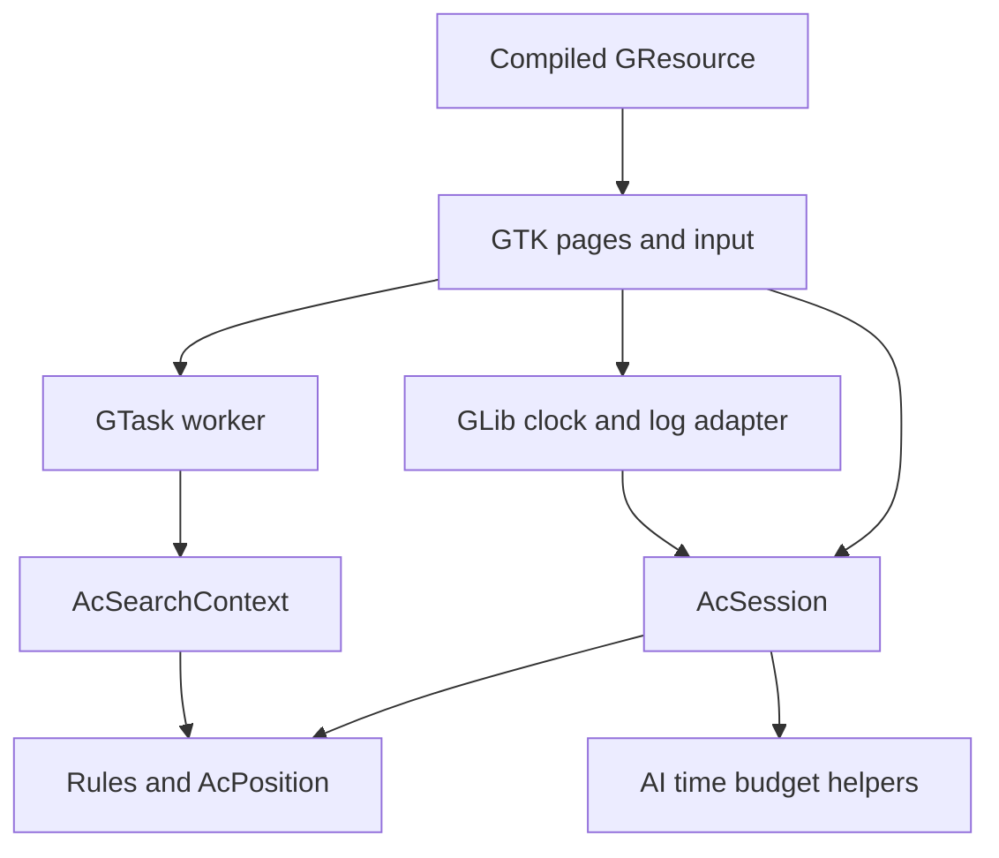
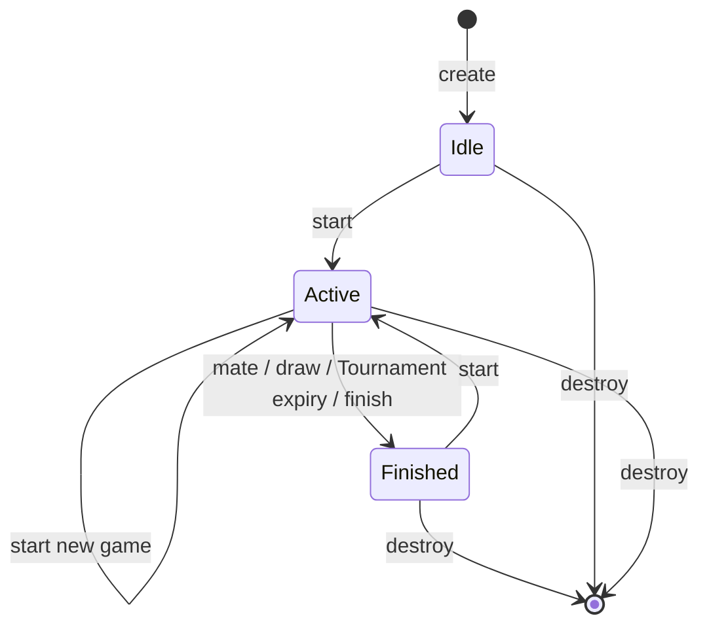

# Software specification

## Architecture

Public interfaces: [types](../include/anteater/types.h), [rules](../include/anteater/rules.h), [session](../include/anteater/session.h), [AI](../include/anteater/ai.h). All public library symbols use `ac_`, `Ac`, or `AC_`. GTK internals are private to the application.

The session has no GTK or GLib dependency. Platform callbacks are injected. It uses AI budget helpers but never initiates a search. Search consumes copied positions and historical hashes and never mutates a live session. The former Controller/event queue/FSM contracts are replaced by synchronous session commands and application-owned navigation.

## Values, ownership, and lifetime

`AcPosition` contains the 80-square board, current side, four castling-right bits, en-passant Ant square, move count, and deterministic 64-bit hash. It has no UI state or history. `AcMove` records endpoints, original moving piece, special kind, and up to ten capture/path entries. `AcUndo` owns the complete previous compact position, including rights and hash.

`AcMoveList` has 1,024 candidates and a sticky status; overflow is `AC_CAPACITY`, never truncation presented as success. Recursive search workspaces are heap-owned. `ac_position_apply` generates legal candidates, matches the complete request, and only then changes the position; failures preserve it. `ac_position_unmake` restores a trusted undo record. Direct fixture edits must recompute `ac_position_hash` before execution. Low-level board helpers permit composing fixtures, not arbitrary validated game import.

`AcSession` owns heap arrays for 1,024 moves, undo records, and 1,025 hashes. Creation requires a clock callback. Optional allocator/deallocator callbacks must be paired and remain valid until destruction. Allocation failure cleans partial construction. Snapshots copy values but borrow history/hash pointers until the next mutation or destruction; callers must copy them for asynchronous use. Sessions are single-owner objects, not internally locked. Independent sessions may be used independently.

`AcSearchContext` owns its transposition table, killer/history heuristics, per-ply move buffers, undo stack, and hash workspace. One invocation at a time per context. Separate contexts share immutable tables only. Search options and callbacks must remain alive throughout the synchronous search. Destroy the context after it returns.

## Session commands and state

Start validates configuration and resets history, position, clocks, diagnostics, and Tournament totals. Each accepted mutation increments a revision. Submit and undo first tick the clock; if ticking changed the revision, a human command returns `AC_STALE_RESULT`. AI submission additionally requires the expected revision. Timeout changes the active side and current hash slot without appending history. Repetition adjudication and the 1,024-move capacity policy belong to the session, not rule generation.

Move processing: parse coordinates → resolve canonical special move/path → apply to a temporary position → determine terminal state → append history and undo → publish a new revision → write the diagnostic log. A move's status reports whether the command applied. Log failure is separately available as snapshot `diagnostic`, so callers never retry an already accepted move merely because logging failed.

Timing uses injected monotonic milliseconds. No core test sleeps or busy-waits for a clock. Elapsed game time freezes on finish; turn time resets on move/undo/skip. Tournament totals and saved-time pools are owned by each session and are not refunded by undo. Its arithmetic and limits live in [budget.c](../src/ai/budget.c).

## Rule engine

[movegen.c](../src/rules/movegen.c) generates variant pseudo-legal candidates, then excludes self-check and king captures. [resolver.c](../src/rules/resolver.c) selects explicit promotion variants and rejects multiple non-promotion paths sharing an endpoint. [position.c](../src/rules/position.c) executes and restores compact positions and updates the hash by XORing changed piece/right components. [endgame.c](../src/rules/endgame.c) determines check, no-legal-move outcomes, and the retained material policy. The [manual](Chess_UserManual.md) is the rules reference.

Hashes include pieces, side, castling rights, and a capturable en-passant file. Numeric keys intentionally differ from the old engine. They support repetition and transposition identity; they are not a persistent storage format or cryptographic guarantee.

## Search

[search.c](../src/ai/search.c) retains iterative deepening, aspiration windows, principal-variation alpha-beta, null-move pruning, late-move reductions, and quiescence. [evaluation.c](../src/ai/evaluation.c) owns piece-square/material evaluation; [ordering.c](../src/ai/ordering.c) owns captures, killer/history ordering and static exchange analysis; [table.c](../src/ai/table.c) owns context-local transpositions. Hard and Experimental select the same implementation.

Results contain the selected legal move, status, completed depth, node count and elapsed milliseconds. Budget exhaustion returns the best available legal move; cooperative cancellation returns `AC_CANCELLED`. Candidate overflow aborts with `AC_CAPACITY`. No legal root move returns `AC_UNAVAILABLE`. Cancellation is checked at search boundaries; elapsed time is checked periodically, so budgets are not hard real-time deadlines.

## Desktop tasks and resources

[gui_async.c](../apps/gtk/gui_async.c) allocates a job containing copied position and hash history, cancellation object, options, result, session revision and GUI generation. GTask runs the search on a worker. Return-on-cancel is disabled: cancellation requests stop, and job memory remains alive until the worker exits and its main-context completion callback runs. The callback accepts a result only when page, generation, revision, and cancellation state still match. Closing cancels and drains outstanding tasks before releasing the session and log object.

GTK owns pages, selection, highlighting, and widgets. No worker accesses widgets. [resources.xml](../assets/resources.xml) embeds SVGs under `/org/anteater/reborn/`; resource lookup is independent of the startup directory. Platform logs use a user-writable directory and per-object file handles/paths.

Upstream API contracts: [GTask thread completion](https://docs.gtk.org/gio/method.Task.run_in_thread.html), [GResource](https://docs.gtk.org/gio/struct.Resource.html), [GTK Windows distribution](https://www.gtk.org/docs/installations/windows/).

## Error contracts and verification

Commands use `AcStatus`: success, invalid argument, illegal move, allocation failure, capacity, cancellation, stale result, unavailable operation, and external I/O failure. Boolean predicates and selection enums explicitly have their own return conventions. Borrowed pointers are never freed by callers. Core APIs do not terminate the process. GLib's ordinary allocation behavior still applies inside the desktop/platform adapters.

See [test migration](TEST-MIGRATION.md) and [validation](VALIDATION.md). Baseline fixtures compare the original move ordering-independent fingerprint, a fixed 50-ply sequence, special boards, and variant perft counts. Random legal apply/unmake checks require byte-identical restoration and full hash recomputation agreement. Session tests cover injected failures, isolation, clocks, repetition and stale results. GTK tests exercise pages, all three modes, hints, undo and shutdown during search. CI supplements these with sanitizers, source rebuilds and runtime smoke tests.
