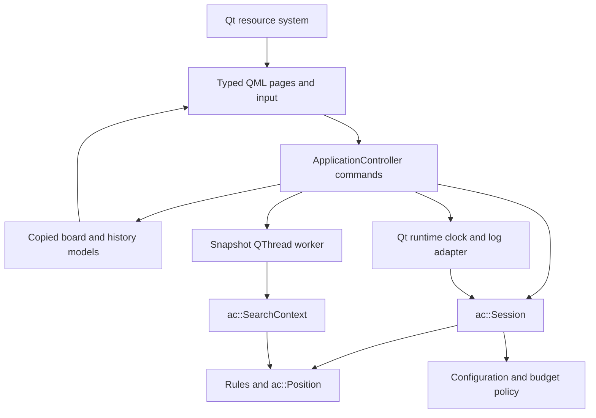
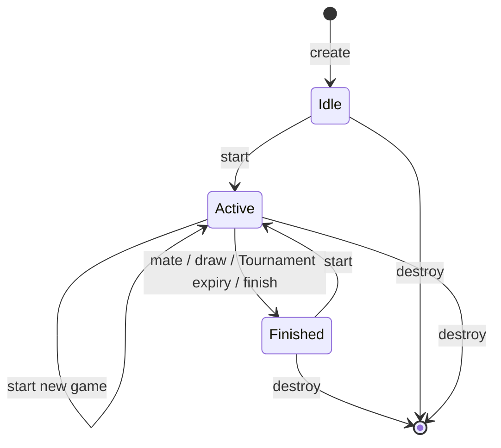

# Software specification

## Architecture

Public interfaces: [types](../../include/anteater/types.hpp), [rules](../../include/anteater/rules.hpp), [session](../../include/anteater/session.hpp), [policy](../../include/anteater/policy.hpp), [AI](../../include/anteater/ai.hpp). Maintained public library interfaces use the `ac` namespace, scoped enums and C++20 value types. Qt desktop internals are private to the application.

An [interactive architecture diagram](architecture.html) is also available.

The session has no Qt, GTK or GLib dependency. Platform callbacks are injected. It uses independent configuration and budget policies and never initiates a search. Search consumes copied positions and historical hashes and never mutates a live session. The former Controller/event queue/FSM contracts are replaced by synchronous session commands and application-owned navigation.

## Values, ownership, and lifetime

`ac::Position` contains the 80-square board, current side, four castling-right bits, en-passant Ant square, move count, and deterministic 64-bit hash. It has no UI state or history. `ac::Move` records endpoints, original moving piece, special kind, and up to ten capture/path entries. `ac::Undo` owns the complete previous compact position, including rights and hash.

`ac::MoveList` has 1,024 candidates and a sticky status; overflow is `Status::Capacity`, never truncation presented as success. Recursive search workspaces are heap-owned. `position_apply` generates legal candidates, matches the complete request, and only then changes the position; failures preserve it. `position_unmake` restores a trusted undo record. Direct fixture edits must recompute `position_hash` before execution. Low-level board helpers permit composing fixtures, not arbitrary validated game import.

`ac::Session` is a noncopyable, movable RAII owner with capacity for 1,024 moves and undo records and 1,025 hashes. Its factory requires an injected clock and memory resource. `SessionState` is an allocation-free value; `SessionSnapshot` owns its moves and hashes across Session mutation or destruction. The resource outlives all objects allocated through it, including moved owners. Clock callbacks do not throw. Allocation failure cleans partial construction and returns `Error`. See [Session ownership](session-ownership.md). Sessions are not internally locked; independent owners may be used independently.

`ac::SearchContext` owns its transposition table, killer/history heuristics, per-ply move buffers, undo stack and hash workspace. Its factory and the owning `SearchRequest` factory return typed errors on allocation failure. Requests copy all inputs synchronously; contexts discard input views before returning. Both owners are noncopyable and movable. See [search ownership](search-ownership.md).

## Session commands and state

Start validates configuration and resets history, position, clocks, diagnostics, and Tournament totals. Each accepted mutation increments a revision. Submit and undo first tick the clock; if ticking changed the revision, a human command returns `Status::StaleResult`. AI submission additionally requires the expected revision. Timeout changes the active side and current hash slot without appending history. Repetition adjudication and the 1,024-move capacity policy belong to the session, not rule generation.

Move processing: parse coordinates → resolve canonical special move/path → apply to a temporary position → determine terminal state → append history and undo → publish a new revision → write the diagnostic log. A move's status reports whether the command applied. Log failure is separately available as a desktop diagnostic, so callers never retry an already accepted move merely because logging failed.

Timing uses injected monotonic milliseconds. No core test sleeps or busy-waits for a clock. Elapsed game time freezes on finish; turn time resets on move/undo/skip. Tournament totals and saved-time pools are owned by each session and are not refunded by undo. Its arithmetic and limits live in [budget.cpp](../../src/policy/budget.cpp).

## Rule engine

[movegen.cpp](../../src/rules/movegen.cpp) generates variant pseudo-legal candidates, then excludes self-check and king captures. [resolver.cpp](../../src/rules/resolver.cpp) selects explicit promotion variants and disambiguates multiple non-promotion paths (for Anteater, prioritizing direct 1-step captures for adjacent endpoints and greedy maximal captures for distant multi-hop endpoints). [position.cpp](../../src/rules/position.cpp) executes and restores compact positions and updates the hash by XORing changed piece/right components. [endgame.cpp](../../src/rules/endgame.cpp) determines check, no-legal-move outcomes, and the retained material policy. The [manual](../user/manual.md) is the rules reference.

Hashes include pieces, side, castling rights, and a capturable en-passant file. Numeric keys intentionally differ from the old engine. They support repetition and transposition identity; they are not a persistent storage format or cryptographic guarantee.

## Search

[search.cpp](../../src/ai/search.cpp) retains iterative deepening, aspiration windows,
principal-variation alpha-beta, null-move pruning, late-move reductions and quiescence.
Evaluation is split into material/position tables, heuristic attacks and SEE,
mobility, strategic features and aggregation; each exposes a narrow private header.
[ordering.cpp](../../src/ai/ordering.cpp) owns killer/history and capture ordering;
[table.cpp](../../src/ai/table.cpp) owns context-local transpositions.
Experimental has been removed. Valid difficulty values are 0, 1, 2, 3 and 5;
4 is rejected by explicit Session configuration validation. Tournament remains 5.

Results contain the selected legal move, status, completed depth, node count and elapsed milliseconds. Budget exhaustion returns the best available legal move; cooperative cancellation returns `Status::Cancelled`. Candidate overflow aborts with `Status::Capacity`. No legal root move returns `Status::Unavailable`. Cancellation is checked at search boundaries; elapsed time is checked periodically, so budgets are not hard real-time deadlines.

## Desktop tasks and resources

[search_jobs.cpp](../../apps/qt/async/search_jobs.cpp) owns one job at a time,
with an owning SearchRequest, stop_source/stop_token cancellation,
result, Session revision and desktop generation. A QThread runs the search.
Cancellation requests stop immediately; it does not require a queued
worker slot. Completion is delivered on the main thread and joined before job
storage is released. Results require matching page, gameId, generation and revision,
and an open, uncancelled desktop. Close disables commands, cancels work, then
waits for cooperative exit before freeing Session/log/model storage.

[application_controller.cpp](../../apps/qt/app/application_controller.cpp) is the only live
Session owner. It executes commands, ticks every 100 ms using injected monotonic
time, queries Rules for selections and legality, and publishes copied projections.
Settings drafts, input, board, history, clocks and status have separate registered
models and change notifications. Ordinary ticks update only clocks. Board/history
models own their values; temporary input spans never reach
QML or workers. Getters do not mutate game state or navigation. QML pages own
controls and layouts; a clock tick or ordinary move does not recreate the page.

[resources.qrc](../../assets/resources.qrc) embeds 14 piece and 4 icon SVGs with
stable `/org/anteater/reborn/` aliases. QML is embedded independently. Assets
are independent of cwd. Qt SVG rendering supplies device-scaled images.
[runtime.cpp](../../apps/qt/runtime/runtime.cpp) uses GetModuleFileNameW on
Windows and `/proc/self/exe` on Linux, preserving actual-executable placement
through symlink launches. Path failure produces a diagnostic-only log service.

Logs default to `<executable-directory>/logs/session-<UUID>.log`; an explicitly
injected log directory remains available for fixtures. Each object owns its path
and rotates files when the game ID changes. Directories are created on the first
write. Path discovery failure keeps a diagnostic-only log object: its write method
returns `Status::IoError` without changing the session command's result. Directory or
file-write failures follow the same contract, with no working-directory or user-data
fallback. A log is a current game snapshot, not a saved-game import format.

Runtime contracts: [QThread](https://doc.qt.io/qt-6/qthread.html), [Qt resources](https://doc.qt.io/qt-6/resources.html), [Windows deployment](https://doc.qt.io/qt-6/windows-deployment.html).

## Error contracts and verification

Commands use `ac::Status`: success, invalid argument, illegal move, allocation failure, capacity, cancellation, stale result, unavailable operation, and external I/O failure. Boolean predicates and selection enums explicitly have their own return conventions. Borrowed pointers are never freed by callers. Core APIs do not terminate the process. Qt's allocation behavior applies inside the desktop adapters. Logs use QSaveFile atomic replacement; failure is diagnostic after accepted operations.

See [test migration](../development/test-migration.md) and [native validation](../development/native-migration/validation.md). Baseline fixtures compare the original move ordering-independent fingerprint, a fixed 50-ply sequence, special boards, and variant perft counts. Random legal apply/unmake checks require semantic restoration and full hash recomputation agreement. Session tests cover injected failures, isolation, clocks, repetition and stale results. Qt Test and Quick Test exercise pages, all three modes, hints, undo and shutdown during search. CI supplements these with sanitizers, source rebuilds and runtime smoke tests.
